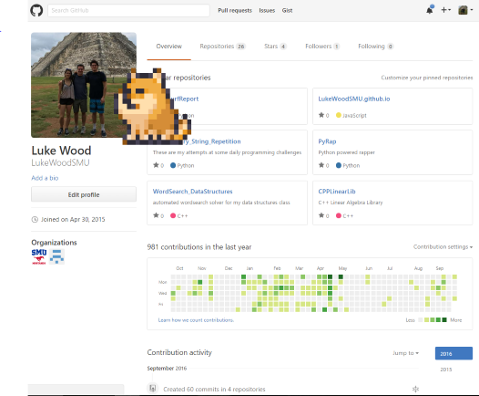

# Doge

**O**nly 

**G**raphics 

**E**nabled

The point of this repository is to show users how to create a backgroundless frame.  This could be used to make a desktop assistant or a general purpose utility tool.

# Running on a Unix Machine
Run the following command from your bash shell.
> wget http://raw.githubusercontent.com/LukeWoodSMU/DOGE/master/DOGE.jar && java -jar DOGE.jar ; rm DOGE.jar

Another way to get the Doge is to install the npm package desktopfriends
```bash
npm install -g desktopfriends && doge
```
# Description
This is an example of how to produce graphics without backgrounds in a cross platform method.

<h1 align="center">
WOW Such Backgroundless!
</h1>



<h1 align="center">
WOW!
</h1>
